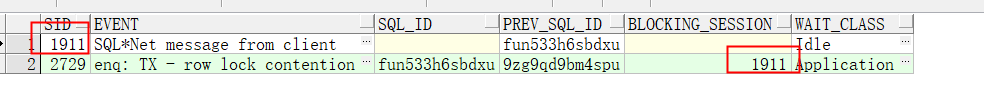
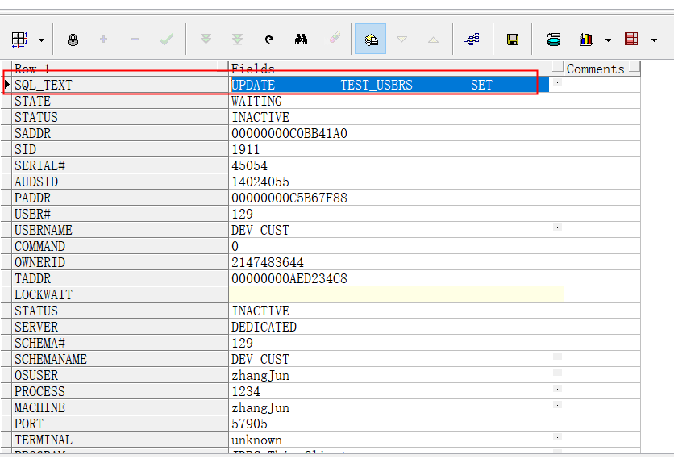
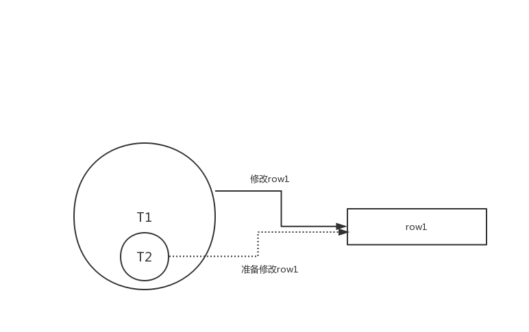
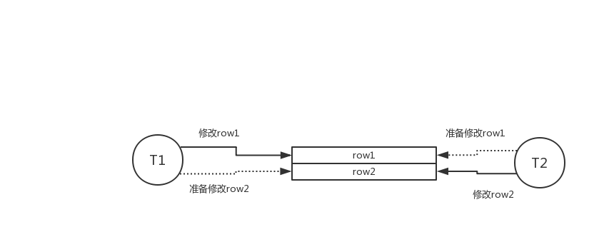

# 性能故障分析之数据库锁

#1、应用分析
根据线程栈找问题

jstack pid >t.dump

#2、数据库分析

###2.1、嵌套事务锁-SQL命令

-- 查询锁，以及锁的会话之间的关系
select t.SID,t.EVENT,t.SQL_ID,t.PREV_SQL_ID,t.BLOCKING_SESSION,t.WAIT_CLASS  from v$session t where t.SID in (

select b.sid  from v$locked_object a,v$session b where a.session_id = b.sid  );

--查询会话正在执行的SQL
select sql_text,b.STATE,b.STATUS,b.* from v$sql a,v$session b where a.SQL_ID=b.PREV_SQL_ID and b.SID=1911;

###2.2、死锁-oracle日志

###2.3、图解
嵌套事务逻辑锁

数据库死锁
